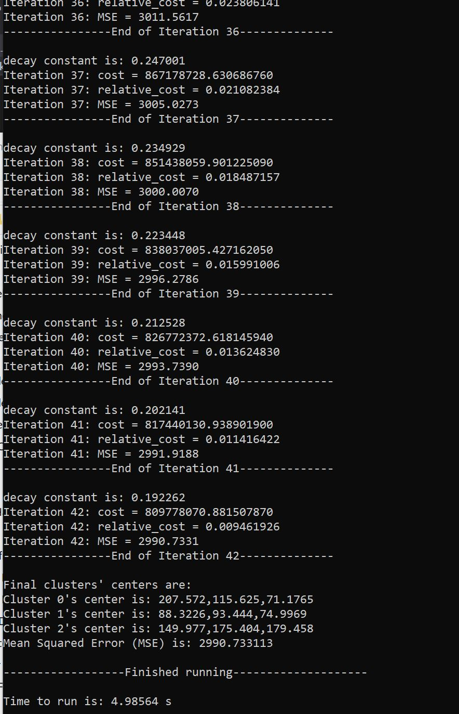

# 
 Clustering Research Fall 2021 

### 
 Author: Dinh Hoang 

### 
 Mentor: Dr. Celebi 

### 
 University of Central Arkansas 

# I. Basic k mean
## Sample results 
a. Original picture

b. Applied batch k mean with k = 2

c. Applied batch k mean with k = 3

d. Run time

k = 2 
k = 3 

# II. Batch Neural Gas
## Sample results 
a. Original picture

b. Applied Batch Neural Gas with k = 2

c. Applied Batch Neural Gas with k = 3

d. Run time

k = 2 

k = 3 

